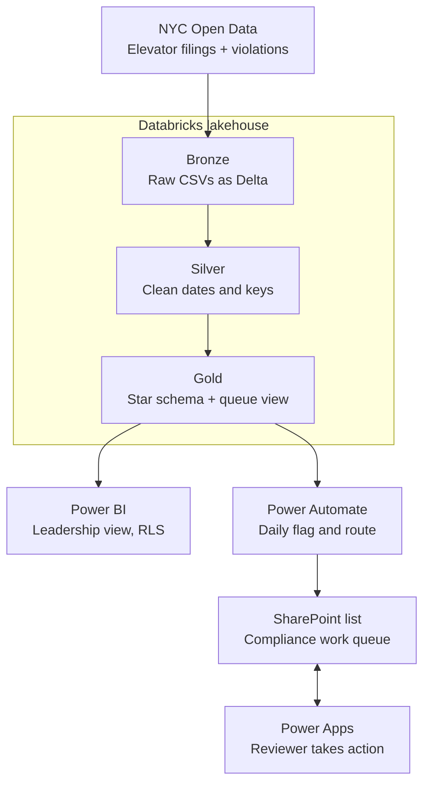

# Elevator Safety Compliance & Risk Tracker

An end-to-end compliance system built on [NYC Department of Buildings elevator inspection data](https://data.cityofnewyork.us/Housing-Development/DOB-NOW-Elevator-Safety-Compliance/e5aq-a4j2). It flags elevators that are overdue or coming due for their mandatory safety tests, routes them into a daily work queue, and lets a reviewer act on each one.

**Stack:** Databricks (PySpark, Delta Lake, Unity Catalog) · SQL · Power BI · DAX · Power Automate · SharePoint · Power Apps

---

## Business problem

Every elevator in New York City must pass two recurring safety tests:

| Test | Frequency | What it checks |
|---|---|---|
| **CAT1** | Every calendar year (due Dec 31) | No-load test of safety devices: brakes, door locks, emergency stop, alarms |
| **CAT5** | Every 5 years | Full-load test of the safety brakes, governor, and buffers at rated capacity |

Across tens of thousands of devices, deadlines slip. A missed test is both a safety risk and a civil penalty. Without a single view of what is compliant, due soon, or overdue, and without anything telling the right person when to act, compliance depends on someone remembering to check.

## Solution



**Design principle: the flow owns the facts, the person owns the decision.** Automation refreshes each device's status every day, but anything a reviewer has already actioned stays exactly as they left it.

---

## Data sources

| Dataset | Source | Grain |
|---|---|---|
| [DOB NOW: Elevator Safety Compliance](https://data.cityofnewyork.us/Housing-Development/DOB-NOW-Elevator-Safety-Compliance/e5aq-a4j2) | [NYC Open Data](https://data.cityofnewyork.us/Housing-Development/DOB-NOW-Elevator-Safety-Compliance/e5aq-a4j2) · [Data.gov catalog](https://catalog.data.gov/dataset/dob-now-elevator-safety-compliance) | One row per elevator device |
| [DOB Safety Violations](https://data.cityofnewyork.us/Housing-Development/DOB-Safety-Violations/855j-jady) | [NYC Open Data](https://data.cityofnewyork.us/Housing-Development/DOB-Safety-Violations/855j-jady) · [Data.gov catalog](https://catalog.data.gov/dataset/dob-safety-violations) | One row per violation |

Both are public, published by the NYC Department of Buildings, and downloadable as CSV. Background on the inspection requirements: [NYC DOB NOW: Safety](https://www.nyc.gov/site/buildings/industry/dob-now-safety.page).

---

## Databricks pipeline

### Bronze
Raw CSVs loaded as-is into Delta tables in `elevator.raw`. Column names with spaces are standardized (e.g. `Device Number` → `Device_Number`).

### Silver (`elevator.clean`)
- Text dates (`MM/dd/yyyy`) converted to real dates
- Device numbers and building IDs (BIN) trimmed and standardized
- Rows with no device number or BIN removed
- Duplicate devices dropped
- Placeholder and legacy filing dates nulled out (see [Data quality](#data-quality-decisions))
- Energy benchmarking violations excluded from the violations table

### Gold (`elevator.model`)

| Table | Description |
|---|---|
| `fact_compliance` | One row per active device: CAT1/CAT5 filed and due dates, next due date, days until due, compliance status, open violations |
| `dim_building` | One row per BIN: borough, address, postcode, latitude, longitude |
| `dim_device` | One row per device: type and status |
| `dim_date` | Calendar table, 2015–2031 |
| `vw_compliance_queue` | View read by Power Automate: up to 100 Overdue and 100 Due Soon devices |

### Business rules

| Field | Rule |
|---|---|
| `CAT1_Due_Date` | December 31 of the year after the last CAT1 filing |
| `CAT5_Due_Date` | 5 years after the last CAT5 filing |
| `Next_Due_Date` | The earlier of the two |
| `Compliance_Status` | **Overdue** if past due · **Due Soon** if within 90 days · **Compliant** otherwise · **No Record** if no valid filing |

```sql
CREATE OR REPLACE VIEW elevator.model.vw_compliance_queue AS
SELECT Device_Number, BIN, Borough, Compliance_Status,
       CAST(Next_Due_Date AS STRING) AS Next_Due_Date,
       Days_Until_Due, Open_Violation_Count
FROM (
  SELECT *, ROW_NUMBER() OVER (PARTITION BY Compliance_Status ORDER BY Days_Until_Due) AS rn
  FROM elevator.model.fact_compliance
  WHERE Compliance_Status IN ('Overdue', 'Due Soon')
)
WHERE rn <= 100;
```

---

## Data quality decisions

| Issue found | Impact | Fix |
|---|---|---|
| Placeholder filing dates in legacy records | First run showed elevators due in **1965**, 60 years overdue | Scoped to the current inspection cycle: CAT1 filings from 2020, CAT5 from 2015 |
| Blank building IDs | Power BI rejected the building relationship (blank keys on the "one" side) | Removed blank BINs from the building dimension |
| Duplicate BINs in the building dimension | Created a many-to-many relationship that would double-count devices | Deduplicated to one row per building, giving a clean one-to-many star schema |

---

## Power BI

- **Overview page:** compliance rate, overdue and due-soon counts, open violations, overdue devices by borough, location map
- **Detail page:** device-level table sorted most overdue first, with drillthrough from the overview
- **Row-level security** by borough, so a regional owner sees only their own devices

Key measures:

```dax
Total Devices   = DISTINCTCOUNT(fact_compliance[Device_Number])
Overdue Devices = CALCULATE([Total Devices], fact_compliance[Compliance_Status] = "Overdue")
Compliance Rate = DIVIDE(CALCULATE([Total Devices], fact_compliance[Compliance_Status] = "Compliant"), [Total Devices])
```

---

## Power Automate flow: `FlagComplianceRisk`

1. **Recurrence** trigger, daily
2. **Execute a SQL statement** against the Databricks SQL warehouse (`vw_compliance_queue`)
3. **Do until** the statement status is `SUCCEEDED` (queries are asynchronous), with a 10-second delay and a terminate on `FAILED`
4. **Select** maps the result array into named fields
5. **Apply to each** device:
   - **Get items** from SharePoint filtered on the device number
   - Exists → **Update item**, system fields only
   - New → **Create item** with `ActionStatus = New`

The flow never writes to `ActionStatus`, `AssignedTo`, or `ActionNotes`, so a reviewer's work survives every daily refresh.

## SharePoint queue: `QueueCompliance`

| Owned by the flow | Owned by the reviewer |
|---|---|
| DeviceNumber, BIN, Borough, ComplianceStatus, NextDueDate, DaysUntilDue, OpenViolations, LastSyncedOn | ActionStatus, AssignedTo, ActionNotes |

## Power Apps: Elevator Compliance Queue

- **Queue screen:** filter by status, borough, and action; search by device; open overdue and due-soon counts; list sorted most urgent first
- **Detail screen:** read-only facts on the left; reviewer actions on the right (set status, assign to me, add notes, mark resolved)

---

## Screenshots

| | |
|---|---|
|  |  |
|  |  |
|  |  |

---

## Challenges worked through

- **Connector mismatch:** the "Azure Databricks" connector failed against an AWS-hosted workspace. Switched to the standard Databricks connector.
- **Asynchronous queries:** Databricks returns `PENDING` first, so the flow polls until `SUCCEEDED`.
- **SharePoint internal names:** renaming the built-in `Title` column to `DeviceNumber` only changes the label. OData filters and Power Fx formulas still reference `Title`.
- **Auto-generated loops:** choosing fields from dynamic content made Power Automate wrap actions in extra loops that silently wrote nothing. Rebuilt the actions with explicit expressions.

## What I'd do in production

- Page through the full result set instead of capping the queue at 200 devices
- Use a service principal instead of a personal sign-in for the Databricks connection
- Move the queue to Dataverse for larger volumes
- Add a daily overdue digest (email or Teams) and a failure alert
- Review the organization's data loss prevention policies before choosing connectors

---

## Repository structure

```
├── notebooks/
│   ├── 01_bronze_ingest.py
│   └── 02_silver_gold.py
├── sql/
│   └── vw_compliance_queue.sql
├── powerbi/
│   └── elevator_compliance.pbix
├── powerapps/
│   ├── QueueScreen.yaml
│   └── DetailScreen.yaml
├── images/
└── README.md
```

## How to run

1. Download both datasets as CSV (open each link, then **Export → CSV**):
   - [DOB NOW: Elevator Safety Compliance](https://data.cityofnewyork.us/Housing-Development/DOB-NOW-Elevator-Safety-Compliance/e5aq-a4j2)
   - [DOB Safety Violations](https://data.cityofnewyork.us/Housing-Development/DOB-Safety-Violations/855j-jady)
2. In Databricks, create the `elevator` catalog with `raw`, `clean`, and `model` schemas, and upload the CSVs to a volume.
3. Run `01_bronze_ingest.py`, then `02_silver_gold.py`.
4. Open the `.pbix` in Power BI Desktop and point the Databricks connector at your SQL warehouse.
5. Create the `QueueCompliance` SharePoint list with the columns above.
6. Build the `FlagComplianceRisk` flow and run it once to populate the queue.
7. Create a blank canvas app, add the SharePoint list as a data source, and paste the YAML from `powerapps/`.

---

*Portfolio project built on public NYC Open Data. Not affiliated with any employer.*
